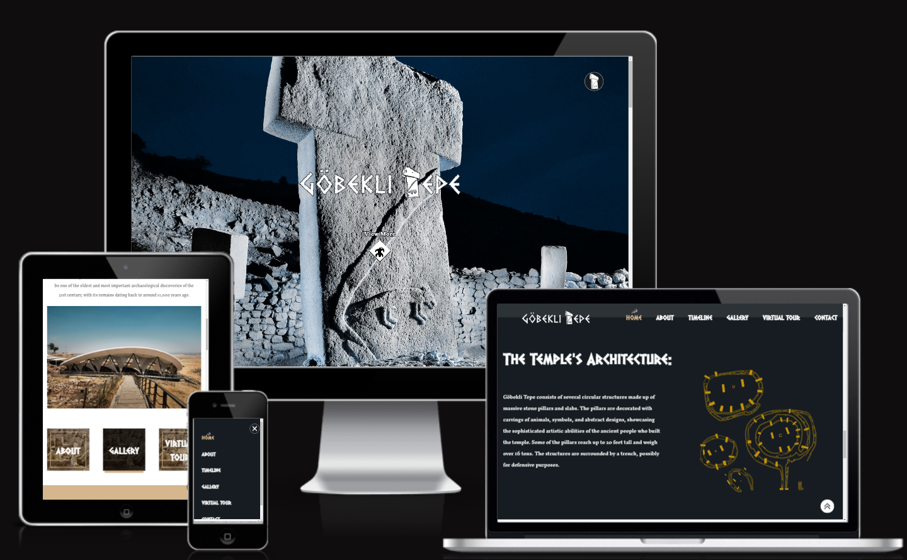
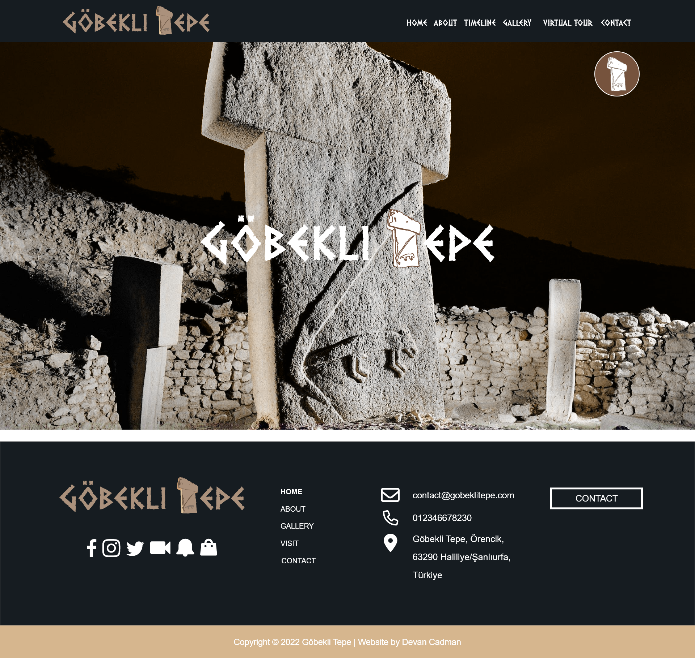
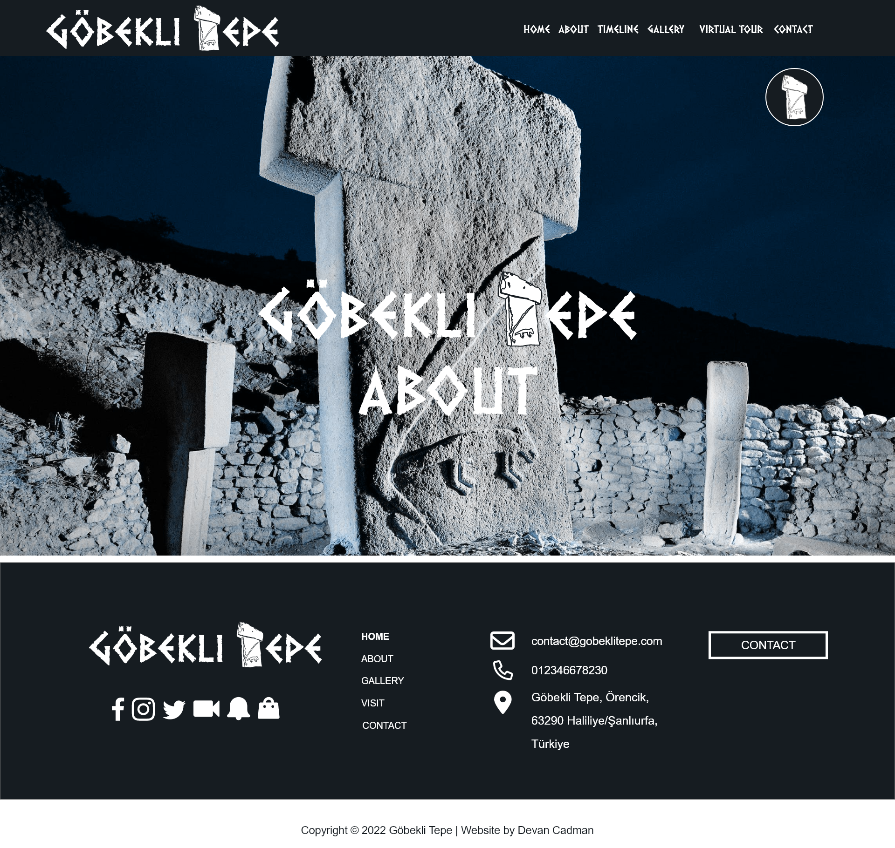
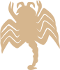

# Göbekli Tepe
##### Code Institute / User-Centric Front-End Development

You can check the website here [Göbekli Tepe](https://devancadman.github.io/MP1-Gobekli-Tepe-Website/index.html)

The main website for Göbekli Tepe. This is my first project which has been designed to be responsive and accessible on a range of devices, making it easy to navigate for visitors. It allows visitors to find out all the information they may need about Göbekli Tepe.

___

## Table of Contents

- [**Introduction**](#Initial-Discusion)
  - [Client Goals](#Client-goals)
  - [User Goals](#First-Time-Visitor-Goals)
- [**Structure**](#Structure)
  - [Common sections](#Common-sections)
  - [Home page](#Home-page)
  - [Gallery page](#Gallery-page)
  - [Contact us Page](#Contact-us-Page)
- [**Future Implementations**](#Future-Implementations)
- [**Design**](#Design)
  - [Colour Scheme](#ColourScheme)
  - [Typography](#Typography)
  - [Imagery](#Imagery)
  - [Wireframes](#Wireframes)
- [**Technologies Used**](#technologies-used)
- [**Testing**](#testing)
- [**Deployment**](#deployment)
- [**Credits**](#credits)
   

## User Experience (UX)

### Introduction
Göbekli Tepe is a Neolithic sanctuary located in the Southeastern Anatolia Region of Turkey. It is considered to be one of the oldest and most important archaeological discoveries of the 21st century.

The website provides users with information about the site. It's targeted toward people who are looking for further information about the site.
Users can use the website the get information about it's history, discovery, symbolisms and tours or to get in touch for further information.

 ### Client Goals: 

  * To have an online presence.
  * To display tour information on the site.
  * To increase traffic to the physical site.
  * Increase our social media presence via social media links. 

### First Time Visitor Goals:

  * I want to quickly and easily find out everything their is to know about the site.
  * I want to easily find images of the site.
  * I want to be able to access and download tour brochures for future use.
  * I want to find out opening times and locations.
  * I want to see the Sites Timeline.

### Returning and frequent Visitor Goals:

  * As a returning or frequent visitor, I want to:
   * Find out about more information (information is regularly updated).
   * Look at new images.
   * Contact for more information.
   * See the Virtual Tour.

___
## Structure ##

 #### The website is has five pages with a link to an external page (home page, about page, timeline page, gallery page, virtual tour (external) and contact page) which are all accessible from the navigation menu.

 #### Common sections:
    
 * Sticky Scroll Navigation bar consisting of the Göbekli Tepe logo on the left side linked to the home page and a navigation menu on the right side with links to Home page, about page, timeline page, gallery page, virtual tour (external) page and contact page. This is displayed when a user scrolls and sticks to the top of the page.
 Initially their is a Custom Nav Button, which opens up a full page navigation screen, providing a responsive navigation for all devices.
 All the links change colour on hover for good user experience.

  |                       **Sticky Scroll NavBar**                               |                           **Custom Nav Button**                                  |
  | :----------------------------------------------------------:        | :-------------------------------------------------------------------:        |
  |   |      |
| **Full Screen Navigation**
  |

 * Hero section with an image of a popular Pillar from the site with contrasting colours to keep the text readable.
 Each page displays the site Logo, with the page title below it, for easy user navigation. Except for the home page. 
 Below this, their is a call-to-action animated button to view more.

* **Animated View More Button**   
  

 

 * Footer is simple and easy to understand with social media links, menu links, contact links and a contact button. The links change colour from white to tan on hover for better user experience.
 * In the Sub-footer it showcases the site's copyright information.

 

### Home Page

 The home page consists of nine sections:

 * Navigation button to easily access the navigation screen.
 * Hero section with Göbekli Tepe's logo with a simple and clean design. And a call-to-action button to view more.
 * A sticky Nav bar to easily and quickly access all the pages.
 * Welcome section with brief intro and image of the site.
 * Box Navigation for quick access to important page's.
 * A Discovery section, detailing the site's discovery.
 * Significance section, explaining the site's importance.
 * An Architecture section, detailing the site's discovery.
 * A Purpose section, with the site's possible purpose.
 * FAQ section, showcasing the answers to common questions, assuages concerns, and overcomes objections.
 * Footer section, consists of social media links, menu links, contact links and a contact button.

 

### About Page

 The About page consists of Nine sections:

 * Navigation button to easily access the navigation screen.
 * Hero section with Göbekli Tepe's logo and page title with a simple and clean design. And a call-to-action button to view more.
 * A sticky Nav bar to easily and quickly access all the pages.
 * The Beginning section, explaining it's discovery, excavations, rediscovery & findings. With a Video for more info.
 * The Most Impressive section, details the site enclosures.
 * Pillars section, explains the pillars and illustrates their decoration
 * 3D Model Video of Göbekli Tepe.
 * Further-info section, provides info and links to books, videography & links for further information about Göbekli Tepe.
 * Brochures section, lists link to Website & PDF Brochures for Tours.
 * Footer section, consists of social media links, menu links, contact links and a contact button.

 

 ### Timeline Page

 The Timeline page consists of three sections:

 * Navigation button to easily access the navigation screen.
 * Hero section with Göbekli Tepe's logo and page title with a simple and clean design. And a call-to-action button to view more.
 * A sticky Nav bar to easily and quickly access all the pages.
 * Timeline section, showing the site's timeline.
 * Footer section, consists of social media links, menu links, contact links and a contact button.

 

### Gallery page

 The Gallery page consists of three sections:

 * Navigation button to easily access the navigation screen.
 * Hero section with Göbekli Tepe's logo and page title with a simple and clean design. And a call-to-action button to view more.
 * A sticky Nav bar to easily and quickly access all the pages.
 * Gallery section, showing images of the site.
 * Footer section, consists of social media links, menu links, contact links and a contact button.

 

### Virtual Tour Page

* This is an External Page, to a Virtual Tour of the Site.

 

### Contact us Page

 The contact us page consists of four sections:

 * Navigation button to easily access the navigation screen.
 * Hero section with Göbekli Tepe's logo and page title with a simple and clean design. And a call-to-action button to view more.
 * A sticky Nav bar to easily and quickly access all the pages.

 * Hero image with "Contact us" message. 
 * Contact information with email, phone number and address, and a contact form so the user can send an email with a message.

 * Footer section, consists of social media links, menu links, contact links and a contact button.

 

 ___

## Future Implementations.

 * Add a full detailed Visit Page.
 * Use Javascript to close an FAQ if another is already open.
 * Add FancyBox for images.
 * Use Javascript to implement a thank you page redirect.
 * Change Image formats to WebP.
 ___

## Design

### Colour Scheme

For the colours I based them off the colours of the stone used at Göbekli Tepe, a type of Tan. I then chose a suitable dark complimentary colour - Dark Navy.

This then gave me two options of how I could implement these colours on the site. In the end I went with Option 2 as this felt more modern and looked better.
|                       **Colour Option 1**                               |                           **Colour Option 2**                                  |
  | :----------------------------------------------------------:        | :-------------------------------------------------------------------:        |
  |   |      |

[ *all colors are set at `:root` level in CSS* ]

- `#161C21` (*Navy*)
- `#d6b68e` (*Tan*)

### Typography

I have tried to use old antique style font's, due to it being an ancient site. I found the Dalek font from doctor who, which really gave the logo an old style look to it. I then chose Inknut Antiqua as this is a more modern font for readability with an old style twist to keep in in keeping with the site.
My preference for fallback font is Arial & Serif.

The Dalek font is a custom font, which I got from dafont.
Inknut Antiqua is a google font.

* [Dalek](https://www.dafont.com/dalek.font) is used for the logo, headers and Welcome messages on the page.
* [Inknut Antiqua ](https://fonts.google.com/specimen/Inknut+Antiqua) is used for the most of the body text on the page.

|                       **Dalek Font**                               |                           **Inknut Antiqua Font**                                  |
  | :----------------------------------------------------------:        | :-------------------------------------------------------------------:        |
  |   |      |

### Imagery 
I have used different sources for images and to create the logo and favicon, all free to use or with owners consent.
Please see [Credits](#credits) section for more info.

### Symbols
Symbols were created using Illustrator and are based on the symbols found within Göbekli Tepe on its various pillars and other areas where symbols have been depicted in reliefs.

 |           **Icon 1**          |           **Icon 2**          |           **Icon 3**          |           **Icon 4**          |
 | :---------------------------: | :---------------------------: | :---------------------------: | :---------------------------: |
 |   |  |  |  |
I used these on both the Gallery & Timeline pages.

#### Logo

When creating the logo I wanted to create a logo that would be easily associated with Göbekli Tepe. I used the Dalek font for this. I then used one of it's pillars to replace the "T" character from the text. I based the symbol off "Pillar 18" and re-created it within Illustrator.
I also used this symbol to create the site favicon.

 |                       **Logo**                               |                           **Favicon**                                  |
  | :----------------------------------------------------------:        | :-------------------------------------------------------------------:        |
  |   |      |

  * To create the logo and Favicon I have used Adobe Illustrator:
 [Adobe Illustrator](https://www.adobe.com/uk/products/illustrator.html) 

 * For the hero image please see reference in credits, I then edited it within Photoshop:
 [Adobe Photoshop](https://www.adobe.com/uk/products/photoshop.html) 

* For the Nav Button and View More button the symbols were created within Illustrator

 |                       **Nav Button**                               |                           **View More Button**                                  |
  | :----------------------------------------------------------:        | :-------------------------------------------------------------------:        |
  |   |      |

### Wireframes

I have usedAdobe XD software to create my wireframes, for desktop and mobile.
The finished product came very close to the initial concepts.

| Desktop  Home                                                         | Desktop Timeline                                                         |
| ---------------------------------------------------------------------  | ------------------------------------------------------------------------- |
|  |   |

| Mobile Home                                                          | Mobile Timeline                                                           |
| ---------------------------------------------------------------------  | ------------------------------------------------------------------------- |
|      |       |

 * [Desktop home page wireframe](/documentation/wireframes-mockups/desktop/home.png)
 * [Desktop about page wireframe](/documentation/wireframes-mockups/desktop/about.png)
 * [Desktop timeline page wireframe](/documentation/wireframes-mockups/desktop/timeline.png)
 * [Desktop gallery page wireframe](/documentation/wireframes-mockups/desktop/gallery.png)
 * [Desktop contact page wireframe](/documentation/wireframes-mockups/desktop/contact.png)
 * [Mobile home page wireframe](/documentation/wireframes-mockups/mobile/home.png)
 * [Mobile about page wireframe](/documentation/wireframes-mockups/mobile/about.png)
 * [Mobile timeline page wireframe](/documentation/wireframes-mockups/mobile/timeline.png)
 * [Mobile gallery page wireframe](/documentation/wireframes-mockups/mobile/gallery.png)
 * [Mobile contact page wireframe](/documentation/wireframes-mockups/mobile/contact.png)
 ___

## Technologies Used
*  [HTML5](https://developer.mozilla.org/en-US/docs/Glossary/HTML5) - building, structuring and presenting project
*  [CSS3](https://developer.mozilla.org/en-US/docs/Web/CSS) - website styling
*  [JavaScript](https://developer.mozilla.org/en-US/docs/Web/JavaScript) - building, structuring and presenting project

*  [Adobe Illustrator](https://www.adobe.com/uk/products/illustrator.html) - To create site icons.
*  [Adobe Photoshop](https://www.adobe.com/uk/products/photoshop.html) - To edit photos.
*  [Adobe XD](https://www.adobe.com/products/xd/learn/get-started/what-is-adobe-xd-used-for.html) - To create Wireframes.

*  [VScode](https://code.visualstudio.com) - code editing
*  [GIT](https://git-scm.com/), [GitHub](https://github.com/) - tracking, storing, hosting project
*  [GitHub Desktop](https://desktop.github.com/) - for local development

*  [Google Fonts:](https://fonts.google.com/) - Google fonts were used to import the 'Inknut Antiqua' font into the style.css file which is used on all pages throughout the project.
* [Coolors](https://coolors.co/) - Coolors was used for choosing the website's colours palette.
* [Tiny PNG](https://tinypng.com/) - To compress images.
*  [Shields.io](https://shields.io/) - To add badges to the README

*  [Chrome DevTools](https://developer.chrome.com/docs/devtools) -  - To troubleshoot and test features, solve issues with responsiveness and styling.
* [Am I Responsive?](http://ami.responsivedesign.is/) &  [Responsinator](http://www.responsinator.com/) - To show the website image on a range of devices.
* [Embed Responsively](https://embedresponsively.com/ ) - To ensure videos are responsive.
* [BrowserStack](https://www.browserstack.com/guide/browser-compatibility-for-variable-fonts) - To check site responsiveness on live devices.
* [Polypane Browser](https://polypane.app/) - Responsive & Accessibility Testing and more!
* [ghostCSS](http://wernull.com/2013/04/debug-ghost-css-elements-causing-unwanted-scrolling/) - To check for layout issues.
* [Can I Use](https://caniuse.com/#home) - to check for CSS Browser comparability issues.
* [Deadlinkchecker](https://www.deadlinkchecker.com/) - To check site for Dead Links.

___

## Testing
See [TESTING.md](https://github.com/devancadman/MP1-Gobekli-Tepe-Website/blob/main/documentation/Testing.md) for an overview of website testing and debugging.

#### TEST MATRIX

I also created a [testing matrix](https://github.com/devancadman/MP1-Gobekli-Tepe-Website/blob/main/documentation/ucfd-user-testing.pdf) in Excel, but saved as `.pdf` to visualize here on GitHub. It outlines the various tests I made to ensure the site renders consistently across different platforms, and that each functionality behaves as intended.

___

## Deployment

The Live link is [Göbekli Tepe's](https://devancadman.github.io/MP1-Gobekli-Tepe-Website/index.html)

#### To deploy the project:
1. In the [GitHub repository](https://github.com/), navigate to the *Settings* tab.
2. Once in Settings, navigate to the *Pages* tab on the left hand side.
3. In the *Build and deployment* section under *Branch*, select the **master** branch and click *Save*.
4. Once the master branch has been selected, the page will be automatically refreshed and a display indicates the successful deployment and the link to the address.

#### To run the website on a local machine:
1. Go to the [MP1 Gobekli Tepe Website repo](https://github.com/devancadman/MP1-Gobekli-Tepe-Website)
2. Click on the green *Code* button and *Download ZIP*
3. Extract the ZIP file on your local machine
4. Run the *index.html* file in a browser

#### To clone the repo:
1. Go to the [MP1 Gobekli Tepe Website repo](https://github.com/devancadman/MP1-Gobekli-Tepe-Website)
2. Click the *Code* button to the right of the screen and copy the *HTTPs* link there
3. Open a GitBash terminal and navigate to the directory where you want to locate the clone
4. Type `git clone` and paste the copied *HTTPs* link, press the *Enter* key to begin the clone process
___

## Credits {#credits}
### Code
 All my code was written based on what I have learned from [CodeInstitute Full Stack Developer Course](https://codeinstitute.net/ie/full-stack-software-development-diploma/) and [W3schools](https://www.w3schools.com/) and other online resources.
 * CSS Reset was added to the site from [Josh's Custom CSS Reset](https://www.joshwcomeau.com/css/custom-css-reset/).
 * CSS [Grid](https://css-tricks.com/snippets/css/complete-guide-grid/) & [Flex](https://css-tricks.com/snippets/css/a-guide-to-flexbox/) was based on what I have learned from [CSS-Tricks](https://css-tricks.com/).
 * Nav Burger/Bento Menu button was implemented and based on this [codepen](https://codepen.io/camille-cebu/pen/MWrGZWR)

### Image References/Attributes:

* Main header Image - Göbekli Tepe - The Stone Age Sanctuaries. New results of ongoing excavations with a special focus on sculptures and high reliefs - Scientific Figure on ResearchGate. Available from: https://www.researchgate.net/figure/Goebekli-Tepe-2006-pillar-18-in-enclosure-D-foto-Berthold-Steinhilber_fig3_270030960 [accessed 23 Feb, 2023]
* T-shaped Pillars - Human Palaeoecology in Southwest Asia During the Early Pre-Pottery Neolithic (c. 9700-8500 cal BC): the Plant Story - Scientific Figure on ResearchGate. Available from: https://www.researchgate.net/figure/T-shaped-pillars-from-Enclosure-D-at-Goebekli-Tepe-images-courtesy-of-the-late-Klaus_fig9_322508486 [accessed 23 Feb, 2023]
* Plan of Gobeliki tepe showing pillar loactions:
New Possible Astronomic Alignments at the Megalithic Site of Göbekli Tepe, Turkey - Scientific Figure on ResearchGate. Available from: https://www.researchgate.net/figure/Plan-of-Goebekli-Tepe-Enclosures-A-B-C-and-D-are-in-the-context-with-enclosure-E-shown_fig1_276320115 [accessed 26 Feb, 2023]
* Location Map - <a href="https://commons.wikimedia.org/wiki/File:Smithsonian_map_g%C3%B6bekli_tepe.jpg">US gov</a>, Public domain, via Wikimedia Commons
* Göbekli-Tepe_Construction_Illustration - Addendum 2: Megafauna Extinction Events Update to the Thunderbolt Extinction Model; the Surprising truth of the Younger Dryas Event that Changes Everything - Scientific Figure on ResearchGate. Available from: https://www.researchgate.net/figure/Double-lobe-legs-and-plasma-sheath-around-solar-center-Enclosure-D_fig2_354010454 [accessed 23 Feb, 2023]
* Tourists image - Photo by Yasemin Durmus: https://www.pexels.com/photo/roof-over-the-gobekli-tepe-turkey-15193961/
* Building D replica - <a href="https://commons.wikimedia.org/wiki/File:%C5%9Eanl%C4%B1urfa_M%C3%BCzesi_G%C3%B6beklitepe_D_Tap%C4%B1na%C4%9F%C4%B1.jpg">Cobija</a>, <a href="https://creativecommons.org/licenses/by-sa/4.0">CC BY-SA 4.0</a>, via Wikimedia Commons
* Plan of excavations 2012 - The role of cult and feasting in the emergence of Neolithic communities. New evidence from Göbekli Tepe, south-eastern Turkey - Scientific Figure on ResearchGate. Available from: https://www.researchgate.net/figure/Plan-of-excavations-and-geophysical-surveys-at-Goebekli-Tepe-graphics-T-Goetzelt-c-DAI_fig3_235799794 [accessed 23 Feb, 2023]
* Aerial View - <a href="https://commons.wikimedia.org/wiki/File:The_archaeological_site_of_G%C3%B6bekli_Tepe_-_main_excavation_area.png">German Archaeological Institute, photo E. Kücük.</a>, <a href="https://creativecommons.org/licenses/by/2.5">CC BY 2.5</a>, via Wikimedia Commons
* Panorama - <a href="https://commons.wikimedia.org/wiki/File:Gobeklitepe_Panorama.jpg">Spica-Vega Photo Arts (Banu Nazikcan)</a>, <a href="https://creativecommons.org/licenses/by-sa/4.0">CC BY-SA 4.0</a>, via Wikimedia Commons
* Animals Pillar_small - <a href="https://commons.wikimedia.org/wiki/File:Reliefs_of_animals,_G%C3%B6bekli_Tepe_Layer_III,_circa_9000_BCE.jpg">Klaus-Peter Simon</a>, <a href="https://creativecommons.org/licenses/by-sa/3.0">CC BY-SA 3.0</a>, via Wikimedia Commons
* wolf pillar - <a href="https://commons.wikimedia.org/wiki/File:G%C3%B6bekli_Tepe_Pillar.JPG">Zhengan</a>, <a href="https://creativecommons.org/licenses/by-sa/4.0">CC BY-SA 4.0</a>, via Wikimedia Commons
* Vulture/bag pillar - <a href="https://commons.wikimedia.org/wiki/File:Vulture_Stone,_Gobekli_Tepe,_Sanliurfa,_South-east_Anatolia,_Turkey.jpg">Sue Fleckney</a>, <a href="https://creativecommons.org/licenses/by-sa/2.0">CC BY-SA 2.0</a>, via Wikimedia Commons
* vultures head stone pillar - <a href="https://commons.wikimedia.org/wiki/File:G%C3%B6bekli2012-3.jpg">Klaus-Peter Simon</a>, <a href="https://creativecommons.org/licenses/by-sa/3.0">CC BY-SA 3.0</a>, via Wikimedia Commons
* Pillar 43 - A “Curious and Sometimes a Trifle Macabre Artistry” - Scientific Figure on ResearchGate. Available from: https://www.researchgate.net/figure/Stone-pillar-from-Goebekli-Tepe-Turkey-source-Deutsches-Archaeologisches-Institut-A_fig2_259708559 [accessed 23 Feb, 2023]
* Pillar 31 - Architecture and imagery in the early neolithic of South-West Asia: Framing rituals, stabilising meanings - Scientific Figure on ResearchGate. Available from: https://www.researchgate.net/figure/Pillar-31-one-of-the-central-pair-of-pillars-in-Enclosure-D-Goebekli-Tepe-with-one-of_fig3_325767557 [accessed 23 Feb, 2023]
* Pillar 51 - Recent Research 2013/14: Insights into a new Enclosure at Göbekli Tepe - Scientific Figure on ResearchGate. Available from: https://www.researchgate.net/figure/Pillar-51-central-pillar-of-Enclosure-H-depicting-a-large-felid-Photo-Nico-Becker-DAI_fig3_265612641 [accessed 23 Feb, 2023] 
* Urfa Statue - Göbekli Tepe - The Stone Age Sanctuaries. New results of ongoing excavations with a special focus on sculptures and high reliefs - Scientific Figure on ResearchGate. Available from: https://www.researchgate.net/figure/The-Urfa-statue-foto-Irmgard-Wagner-DAI_fig6_270030960 [accessed 23 Feb, 2023]
* The site futuristic shelter - A Haunted Landscape and Its Drained Souls: The Last Rush to Heritage and Archaeology in Turkey - Scientific Figure on ResearchGate. Available from: https://www.researchgate.net/figure/The-site-of-Goebeklitepe-with-its-futuristic-shelter-that-allegedly-cost-65-million_fig2_349975124 [accessed 23 Feb, 2023]
* Pillar 27 Lion - Symbols of Power - Symbols of Crisis? A Psycho-Social Approach to Early Neolithic Symbol Systems - Scientific Figure on ResearchGate. Available from: https://www.researchgate.net/figure/Relief-of-a-lion-or-panther-in-a-crouching-position-on-pillar-P27-Goebekli-Tepe_fig3_260248860 [accessed 23 Feb, 2023]
* Viper Pillar - PETERS J., DRIESCH VON DEN A. and HELMER D. 2005 - The Upper Euphrates-Tigris Basin: Cradle of agro-pastoralism ?, in VIGNE J.D., PETERS J. and HELMER D. (eds) New methods and the first steps of mammal domestication . Proceedings of the 9th International Council of Archeozoology. (Durham, 23rd-28th August 2002). Oxford: Oxbow Books : 96-123. - Scientific Figure on ResearchGate. Available from: https://www.researchgate.net/figure/Goebekli-Tepe-T-shaped-stone-pillar-with-representations-of-snakes-probably-viper_fig2_263331501 [accessed 23 Feb, 2023]

### A personal thank you to:
* My Cohort Facilitator -  [Iris Smok](https://github.com/Iris-Smok) for her help & support.
* My Mentor for continuous helpful feedback.
* Tutor support at Code Institute for their support.
* My course collegues for helping me with any questions I had.